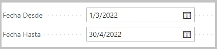
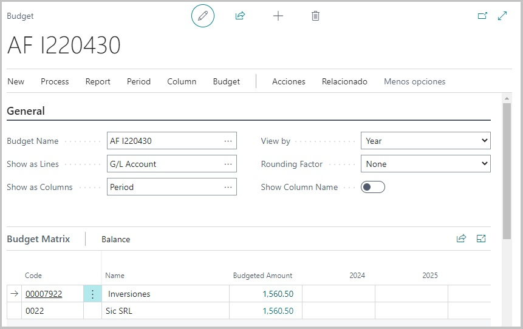
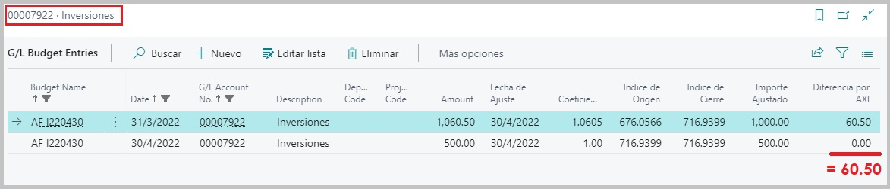
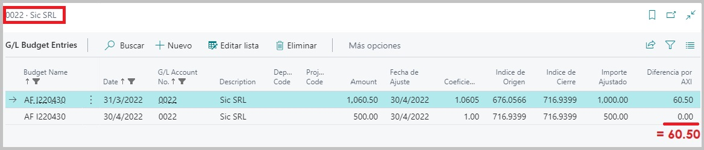
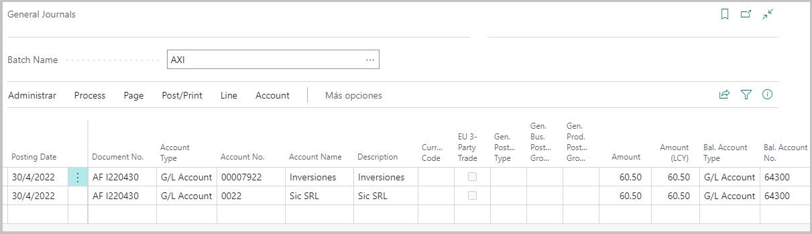
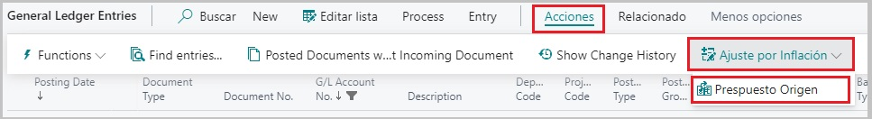
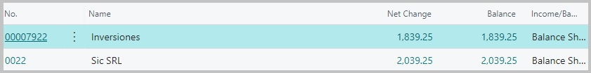

#**Generación de asientos contables**

El proceso de generación de asientos dentro de un diario predeterminado para el proceso de ajuste por inflación, puede surgir a partir de:

1. Haber predeterminado dentro de la ventana de configuración del proceso, al comienzo, que era preciso generar el presupuesto contable y los asientos de manera
simultanea.

2. Desde el módulo de presupuesto en **ACCIONES → AJUSTE POR INFLACIÓN → GENERAR ASIENTOS CONTABLES**.

En ambos casos, el resultado será haber generado los asientos dentro del diario configurado. La diferencia radica en los momentos en los que son generados. 

Debido a que el módulo de presupuesto tiene como finalidad ser una pre visualización del plan de cuentas y principalmente de aquellas cuentas y sus saldos, que han sido
afectadas por el proceso de ajuste, nos brinda la posibilidad de poder editar las partidas que dieron origen a este saldo ajustado que, aunque dependiendo la opcion 1 o 2 que elijamos
podriamos tener creados los asientos en el diario, se encontrarian sin contabilizar, por lo que modificar y/o eliminar el presupuesto o información de alguna de las
cuentas no representaría ningún inconveniente.

Analizando cada caso a detalle:

* En el primer caso (Generación de asientos en simultaneo cuando se creo el presupuesto), tendremos creados tantos asientos contables dentro del diario, como cuentas diferentes hayan
sido ajustadas. Estas estarán sin contabilizar por lo que, desde el prespuesto que dió origen a estos asientos, podremos seguir editando la información de las cuentas, pero deberemos 
aceptar las condiciones de actualización que el proceso ofrece. 

Luego de confirmar...

Este proceso de control se produce con el fin de que, si por alguna razón, se modifica el presupuesto y no se actualizan los cambios generando nuevamente los asientos en el diario y se
contabilizan los antiguos asientos sin modificar, el presupuesto de origen y los asientos registrados en la contabilidad de las cuentas no queden desfasados.

Se limpian las lineas creadas dentro del diario y se deberán generar nuevamente los asientos desde la opción determinada en la pagina principal del presupuesto. 

* Este último caso, donde hablamos de disparar el proceso desde la página principal del prespuesto, corresponde a la opción 2, antes mencionada.

 
 

##**Proceso de contabilización**

Para explicar el proceso de contabilización, trabajaremos con las cuentas:

Ambas cuentas, poseen movimientos en los meses de marzo, abril y mayo.

El primer ajuste lo haremos en el siguiente rango de fechas:

Dentro del presupuesto podemos ver que las partidas afectadas en cada cuenta son:

Hemos remarcado dentro de las imagenes en cada una de las cuentas un total, en la parte inferior del campo **Diferencia por AXI**, esto es porque, los montos que figurarán en los asientos dentro del diario
serán estos, mas precisamente *será la sumatoria de las diferencias de AXI de todas las partidas dentro del presupuesto* y podremos corroborarlo ingrensando dentro del diario.

Podremos visualizar:

Estas lineas de diario se crearán con el número de cuenta de ajuste que se haya seleccionado para la cuenta principal, recordamos que si dentro del la configuración de la cuenta,
teniamos seleccionado el check de que esa cuenta iba a ajustarse, automaticamente se le asignaba su mismo número de cuenta como cuenta de ajuste, pero si tenía seleccionado el segundo check
que correspondía al ajuste en otra cuenta, debiamos seleccionar otra como cuenta de ajuste, diferente a la principal.

Esta cuenta que se haya determinado como *cuenta de ajuste*, será la que aparecerá en la linea del diario y, en cuanto al monto, será como dijimos el total de la la sumatoria
de las diferencias AXI.

Por último, como cuenta de balance, se utilizará la cuenta que se haya determinado dentro de la ventana de configuración de ajuste por inflación, ya sea la cuenta de balance predeterminada
para ganancias o la cuenta para perdidas.

Luego de contabilizar, podremos ver dentro del plan de cuentas los nuevos saldos luego del ajuste.

Dentro de cada cuenta, queda un registro para poder vincular el movimiento con el presupuesto que le dio origen. Para poder visualizarlo, nos dirigimos a la opción de 
**ACCIONES → AJUSTE POR INFLACIÓN → PRESUPUESTO ORIGEN**

*Nota: Una vez contabilizado, el presupuesto no podra ser editado ni eliminado. Al intentarlo, nos encontraremos con el siguiente aviso:*

Con esto evitamos que se puedan modificar valores del prespuesto y el movimiento registrado no coincidida con su ajuste de origen.

##**Ajustes posteriores**

Como vimos, el ajuste por inflación impacto dentro de las cuentas agregando a su contabilidad un movimiento que correspondia con la diferencia que resulto luego del proceso.
Pero, tendremos que entender como impactará un proximo ajuste.

Si corremos el proceso para las siguientes fechas: 

El presupuesto obtenido será:

Si miramos el detalle ingresando en alguna de las cuentas ajustadas:

Si generamos los asientos en el diario, podriamos observar lo siguiente:

Podemos ver que para este segundo ajuste, el monto de los asientos no es justamente, como en el caso anterior, la sumatoria de las diferencias AXI y esto se debe a que,
cuando realizamos un nuevo ajuste integrando un ajuste anterior, el proceso se encarga de realizar una reversión del asiento AXI anterior, para crear un asiento con la diferencia entre
la sumatoria de las diferencias AXI actual para una de las cuentas ajustadas, menos el último asiento de ajuste que se registró en la cuenta.

Debido a este calculo que el proceso realiza es que, al contabilizar estos últimos asientos, las cuentas quedarán actualizadas y podremos visualizar en sus saldos, sin entrar al detalle
este último valor obtenido por ajuste por inflación.

*Antes... (Último asiento $60.50)*

*Ahora (Último asiento... $78.75, pero la sumatoria AXI por el último ajuste debió ser $139.25)

Y dentro de la contabilidad de cada cuenta, recordemos que tendremos ambos asientos por ajuste, pudiendo desde ahí acceder al presupuesto que le dió origen como mencionamos anteriormente.

