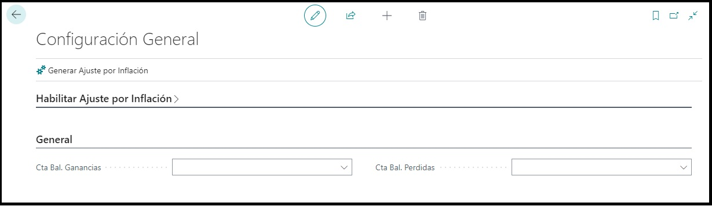

#**Configuracion General**

##**Objetivo**

Este formulario permite incorporar las parametrizaciones generales que deberán realizarse para este módulo, antes de comenzar con sus respectivas configuraciones.

Para realizar la correspondiente configuración se deberá ingresar al formulario, debiendo seleccionar desde el panel de navegación del menú **AJUSTE POR INFLACIÓN → CONFIGURACIÓN GENERAL**.

###**Ventana de Configuración**

###Las tres secciones a completar dentro de la configuración serán las siguientes:

**Habilitar Ajuste por Inflación:**

* En esta sección podremos habilitar dentro de Business Central todo las opciones y funcionalidades que corresponden a este módulo.

**General:**

* En esta sección tendremos que seleccionar las cuentas de contrapartida que se utilizaran para registrar los movimientos de ganancias o perdidas luego de correr el proceso de Ajuste por Inflación.

**Configuración de Diario:**

* En esta sección lo primero será configurar la opción de **Presupuesto y Asiento Contable**. El proceso general de Ajuste creará un presupuesto contable para pre-visualizar los resultados obtenidos
luego del impacto en las cuentas seleccionadas para el ajuste. Posteriormente, se podrán o no, generar asientos contables en base a estas cuentas ajustadas. El campo en cuestión, permitirá decidir según las necesidades del usuario si,
en el momento de correr el proceso de Ajuste, se desea generar solamente el presupuesto contable y luego de su revision y/o corrección, generar los asientos contables *(Botón desactivado)* o, si por el contrario,
se desean generar ambos procesos en simultaneo *(Botón activado)*.

* Lo segundo a configurar será el campo de **Nombre de Diario**. En este caso, este será seleccionable de una lista de diarios, es decir el usuario deberá tener creado previamente un diario con las configuraciones deseadas
para luego seleccionarlo dentro de la ventana de configuración. A partir de esto, en el momento que se generen las lineas correspondientes a los montos ajustados de las cuentas seleccionadas para el proceso de ajuste, se crearán
dentro de este diario que fue seleccionado con anterioridad.