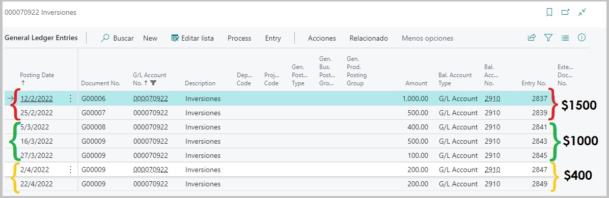
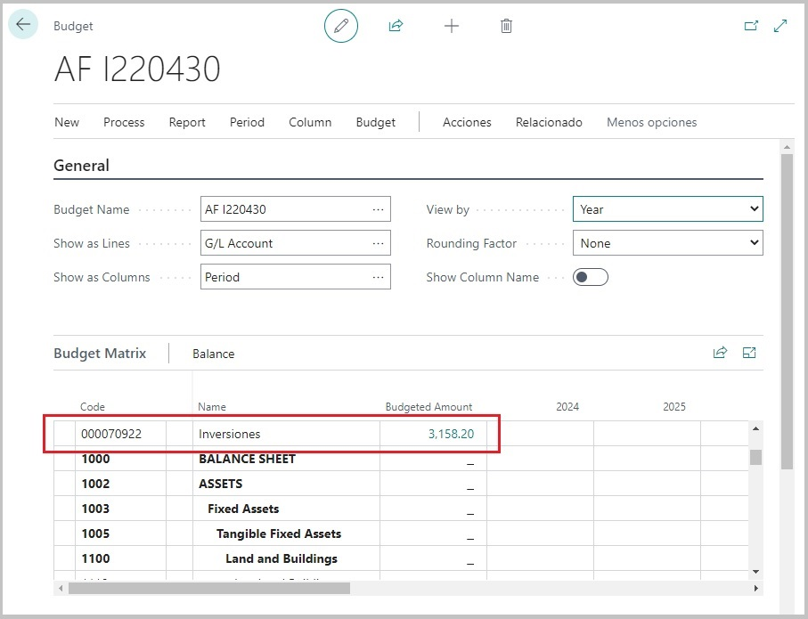
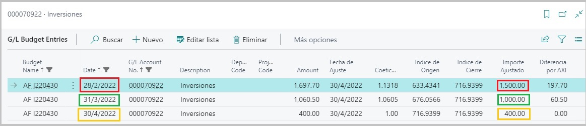

#**Detalle del Proceso de Ajuste**

En un principio se debió haber establecido si se deseaba que el proceso de ajuste por inflación generara solamente un presupuesto contable con las cuentas ajustadas o
un presupuesto y además la creación de asientos en el diario configurado también anteriormente en la ventana principal.

A continuación detallaremos cada proceso:

##Presupuesto Contable

El módulo de presupuesto será el primer impacto que tendrá este proceso de ajuste. 
Luego de la selección de fechas dentro de la ventana de configuración para el proceso, se generará un presupuesto contable que tendrá como finalidad ser una
pre visualización de las cuentas que fueron afectadas y sus nuevos saldos ajustados. Además, dentro del presupuesto, ingresando en cada cuenta en particular
podremos ver el detalle de su anticuación**¹**.

Al ingresar dentro del detalle de la cuenta en este modulo, podremos observar que las partidas se encuentran agrupadas por fechas. Es decir, observemos el siguiente ejemplo:

*La cuenta **000070922 "Inversiones"**, posee los siguientes movimientos:*

* Podemos observar que la cuenta contiene movimientos durante los meses de febrero, marzo y abril, y que hay más de un movimiento dentro de cada mes.

Para entender mejor lo que visualizaremos dentro del detalle y las agrupaciones por fecha que mencionamos para el módulo de presupuesto, tendremos en cuenta lo siguiente:

Cuando se corra el proceso de Ajuste por Inflación, dentro de este periodo de fechas:

Se generará de manera automatica un presupuesto que contendrá el detalle de las cuentas que fueron afectadas por el proceso.

Si ingresamos al detalle de la cuenta **"Inversiones"**, haciendo click sobre el saldo, podremos ver la agrupación de las partidas que se encuentran comprendidas dentro
del periodo de fechas seleccionado para el proceso de ajuste.

Como podemos ver, se crearon unicamente tres registros en donde se utilizo como fecha de cierre de cada una de las partidas, el último dia del mes en el que se encuentran comprendidas, y
el saldo a ser ajustado es la sumatoria de saldos de estos movimientos.

Otra cuestión importante en esta sección es entender que representa cada campo.

* Monto: Es el saldo resultante luego de que se le aplicara el coeficiente obtenido luego de los calculos entre el Indice de cierre y el Indice de origen. Es decir, **SALDO AJUSTADO**.
* Fecha de ajuste: Fecha "hasta", es la fecha final de las seleccionadas a la hora de correr el proceso de ajuste por inflación.
* Coeficiente: Factor obtenido como resultado del calculo de indices (Indice de cierre / Indice de origen), que luego será aplicado al monto de la partida para el ajuste.
* Indice de Origen: Indice correspondiente a la fecha de registracion de las partidas, más precisamente al mes en cuestión. Estos se obtienen de la tabla de indices disponible en Business Central. 
(Para más información sobre indices y coeficientes, consultar la documentación).
* Indice de Cierre: Indice correspondiente a la fecha hasta sobre la cual se decidió correr el proceso. Estos se obtienen de la tabla de indices disponible en Business Central. 
(Para más información sobre indices y coeficientes, consultar la documentación).
* Importe Ajustado: Es la sumatoria de los saldos de las partidas agrupadas **SIN AJUSTAR**.
* Diferencia por AXI**²**: La diferencia AXI, es el resultante entre el **Monto Ajustado - Monto sin Ajustar**. Este valor será sumamente importante en paso posterior, si se desease
generar asientos contables para este presupuesto.

 
 
 
 
 
 
** *Nota: Para el proceso de ajuste, la sección anterior es muy importante ya que a partir de los campos que vimos es como luego, de ser deseado, se crearán los asientos cen el diario.
Este detalle del armado de asientos lo veremos en la proxima documentación.* **

💡 *¹:La anticuación del saldo de una cuenta contable, consiste en su descomposición en partidas o grupos de partidas, según los distintos momentos o períodos de origen de estas, 
a efectos de re expresarlas en moneda de cierre.*

💡 *²: Termino que hace referencia abreviadamente a "Ajuste por Inflación".*