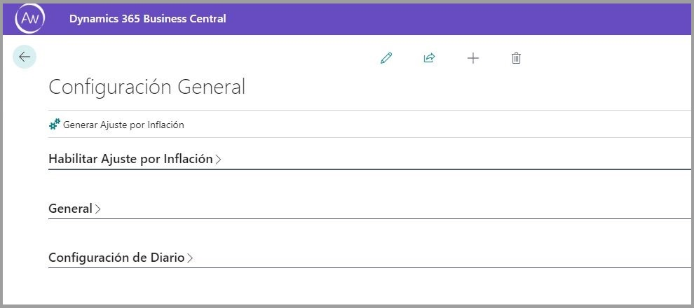
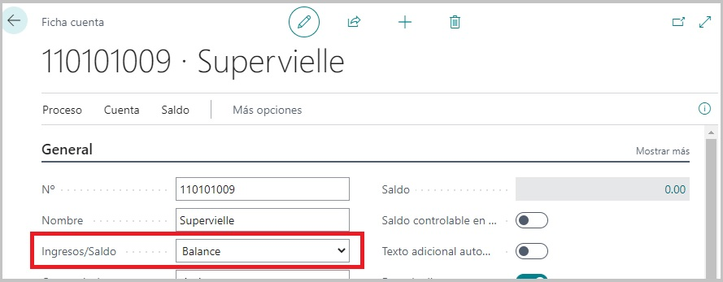
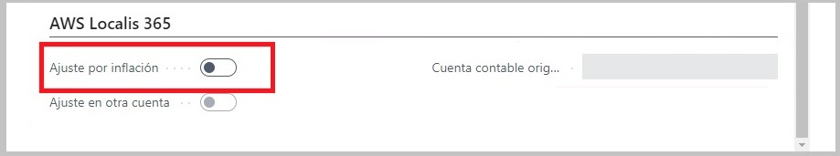
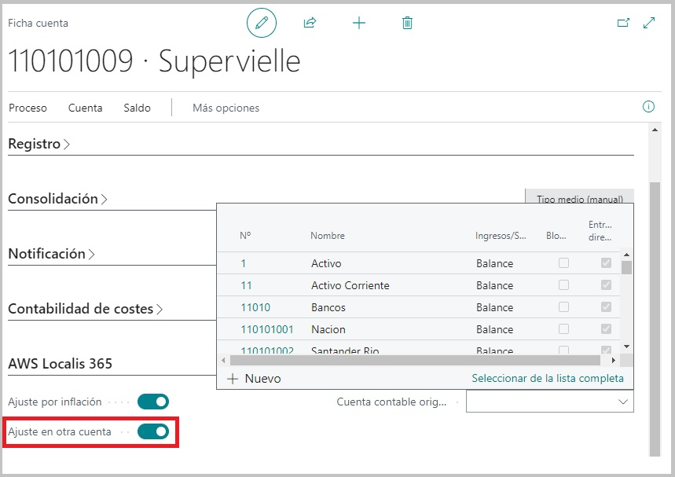
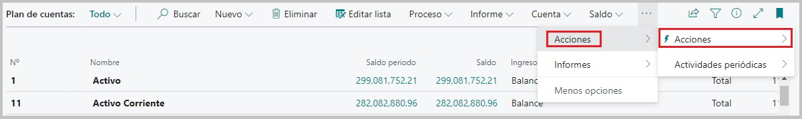
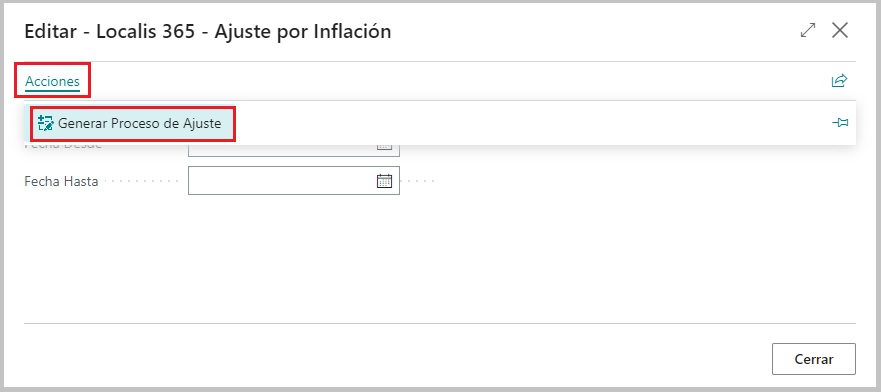

#Descripción del proceso secuencial de ajuste contable por inflación

Este proceso en el ERP permitirá ajustar los saldos de cuentas contables a una determinada fecha, a partir de cálculo de coeficientes por mes. 
Para ello en el proceso de ajuste por inflación se deben tener en cuenta las siguientes etapas:

**1.** Realizar las parametrizaciones en la ventana de configuración: Hablitar el proceso y todas sus funcionalidades, configurar las cuentas de contrapartida, establecer
si se creará el presupuesto y los asientos de diario en simultaneo o no y, por último, seleccionar el nombre del diario sobre el cual se crearán las lineas correspondientes a 
las cuentas que han sido afectadas por el proceso. Dicho diario, deberá seleccionarse de los existentes o haberse creado con anterioridad.

**2.** Verificar que la tabla de Indices esta precargada correctamente y actualizar para corroborar que tenemos disponibles los últimos indices a la fecha.

**3.** Chequear dentro del plan de cuentas que las cuentas tengan asignadas correctamente la tipificación necesaria para el proceso, es decir, que sean cuentas de tipo **BALANCE**.

**4.** Corroborar que dentro del plan de cuentas, todas las cuentas que deseamos ajustar, tengan activado el check de Ajuste, dentro de su configuración.

**5.** En el proceso general, si la cuenta tiene activado el check de **Ajusta**, tendrá asignado por defecto que el ajuste se hará sobre la misma cuenta, pero si, se requiere que el 
proceso ajuste sobre otra cuenta, se deberá seleccionar el check de **ajusta en otra cuenta** y además, elegir dicha cuenta en el otro campo.

**6.** Desde el maestro de Plan de cuentas, tendremos el disparador para el proceso de Ajuste, donde luego visualizaremos una ventana emergente que nos permitira determinar el rango de fechas 
sobre el que operaremos para este proceso.

**7.** Generación de presupuesto y opcionalmente asientos contables, según se haya configurado.

*(Si se seleccionó solo generación de presupuesto).*

*(Si se seleccionó generación de presupuesto y asientos contables en simultaneo).*

** *Este último paso será explicado más a detalle en el próximo documento.* **

