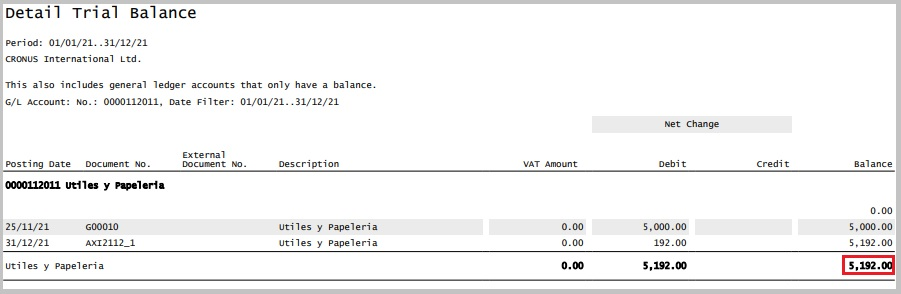
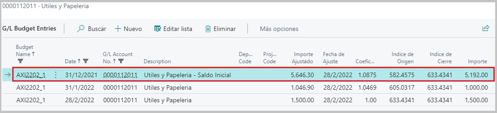

#**Saldos Iniciales**

A continuación explicaremos un poco más a detalle como es que el proceso de Ajuste por Inflación impacta sobre los saldos iniciales de algunas de las cuentas
que fueron seleccionadas y configuradas para el ajuste.

##**Tipos de cuentas**

- Cuentas de Resultado
- Cuentas Patrimoniales

No explicaremos la definición de cada una de estas cuentas, sino que nos centraremos en el impacto del proceso en cada una de estas.

Cuando se cierra un periodo contable, es decir se realiza un *Cierre de Ejercicio Contable* el impacto que reciben los tipos de cuenta es diferente. 

Luego del cierre y una vez se han realizado los ajustes pertinentes, se procede a cancelar las cuentas de **resultado**, es decir ingresos, gastos y costos para determinar la utilidad del ejercicio, 
y esta cancelación se registra mediante asientos contables que se realizan en cada una de las cuentas.
Es al momento del cierre contable cuando las cuentas de ingresos se debitan y las cuentas de gastos y costos se acreditan, con el fin de cancelarlas, es decir, dejarlas en ceros.
Esto hace que estas cuentas en un proximo periodo contable no posean saldo inicial, sino que inicien con saldo cero.

Por el contrario, las cuentas de tipo **patrimoniales** son aquellas que arrastran su saldo al finalizar el periodo contable y se convierte en lo que se denomina saldo inicial
para el periodo contable siguiente.
Business Central no realiza asientos de cierre ni asientos de apertura para las cuentas patrimoniales como se podria esperar, por lo cual, el proceso de Ajuste
por Inflación, realiza lo necesario internamente para que el saldo inicial sea incluido en el proceso, solo en el caso de este segundo tipo de cuentas.

##**Ejemplo:**
###**Supongamos que:**

* La cuenta de ejemplo posee movimientos durante el periodo 2021. Si emitimos un reporte para visualizar a detalle estos movimientos:

* Luego de hacer un cierre de ejercicio contable y teniendo en cuenta el saldo final para este periodo contable. Podemos determinar que debido al tipo de cuenta,
este será su **Saldo Inicial** en un proximo periodo contable abierto activo.

* Si corremos el proceso de Ajuste por Inflación desde el 1-1-2022 al 28-2-2022. Obtendremos un presupuesto y a la vez, la posibilidad de ver el detalle de la
anticuación de la cuenta dentro del presupuesto, incluyendo el ajuste al **saldo inicial**:

