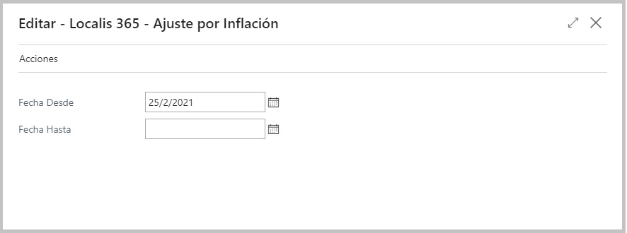
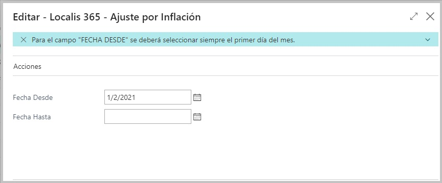
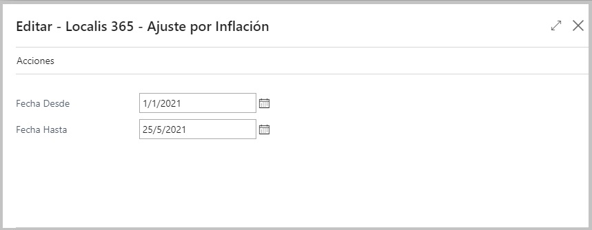
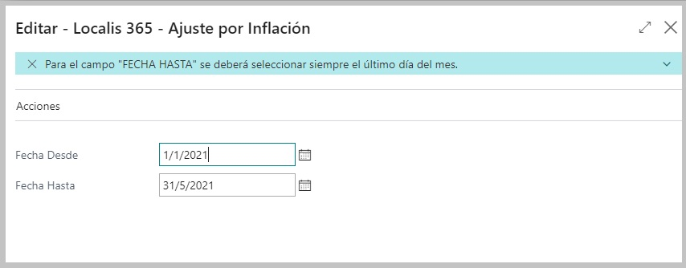
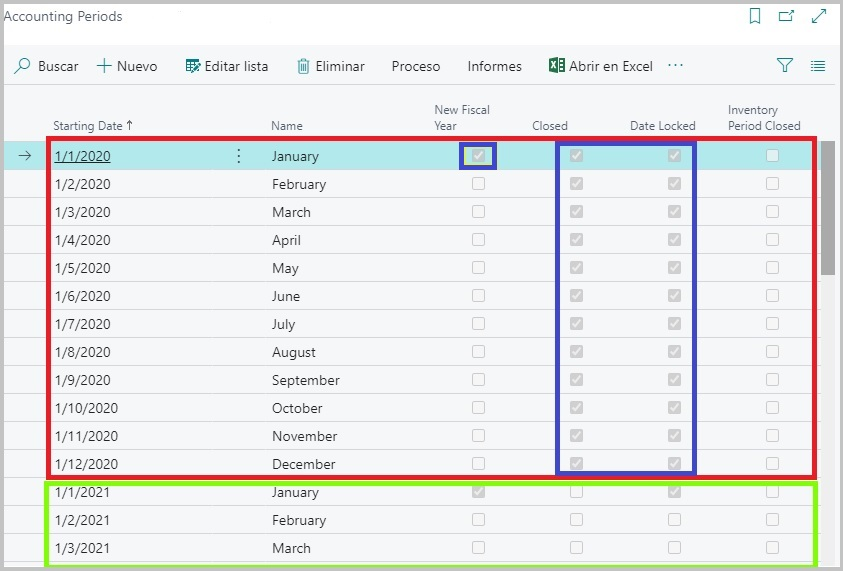
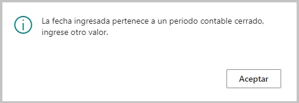

#**Proceso de Ajuste y validación de fechas**

El proceso de Ajuste por Inflación posee un formulario configurable que disparará el proceso desde el plan de cuentas de Business Central.

##**Validaciones y Controles**

Debemos tener en cuenta que para el proceso no se podran ingresar todos los valores posibles de fechas, sino que, solo serán permitidas aquellas que cumplan con algunas condiciones.

- En primer lugar, el primer control se hará a modo de buen uso, ya que para el campo de *Fecha Desde* solo se deberán ingresar valores correspondientes al primer día del mes
desde el que se haya decidido ajustar. De lo contrario, si se ingresase un valor diferente al día **1** del mes, el sistema automaticamente arrojara una aviso al usuario,
informandole cual es el valor esperado para este campo.

De la misma forma, se realizará un control pero para el campo de **Fecha Hasta**. En este caso, se validará que en el campo solo se ingresen valores correspondientes al último
día del mes hasta el que se haya decido ajustar. De lo contrario el programa restaurará el valor y colocará el correcto en el campo.

- Una vez que se hayan validado correctamente los valores ingresados para las fechas, como segundo control tendremos el de periodos contables.

Dentro de Business Central, tenemos la posibilidad de crear periodos contables según la necesidad de cada empresa.
Un periodo contable se compone de una fecha de inicio y de una fecha de cierre, en la cual, se podrá realizar lo que se denomina *Cierre de ejercicio contable*, pudiendo
así impactar en los diferentes tipos de cuentas y definir también, el año fiscal para dicha empresa.

La cantidad de meses que compongan un periodo contable y las fechas de inicio y finalización del periodo serán meramente decision de la empresa. 

En el caso del formulario de ajuste, los campos de **Fecha Desde y Fecha Hasta** validarán que la elección de fechas del usuario pertenezcan a lo que se denomina
*Periodo contable abierto*. Es decir, es el periodo contable actual, el que todavia no ha sido cerrado ni se posee ningun asiento de cierre registrado para la fecha de finalización.

##**Periodos contables**

Lo siguiente que se muestra es la tabla donde se almacenan los periodos contables creados, ya sean, cerrados o abiertos.

- Al principio de la lista tenemos el periodo creado para el año 2020. El cual se compone por una fecha de inicio del periodo **(1/1/2020)** y una fecha de finalización 
**(1/12/2020)**, dicha fecha no tiene ningun campo que la identifique como "fecha final", pero, dado que luego de esta podemos observar que tenemos la fecha de **1/1/2021**
que si posee un campo que la identifica como el inicio del posterior periodo contable creado, se determina que el mes anterior, corresponde al cierre del periodo.

Dado que el periodo contable 2020 se encuentra cerrado desde esta seccion y además posee asientos de cierre de ejercicio registrados para la fecha de finalización del periodo
**(31/12/2020)**, no resultará posible seleccionar cualquier tipo de fecha que se encuentre comprendida en este periodo. 

**Para el proceso solo se podran elegir fechas que integren el periodo contable actual activo abierto de la compañia.**

En el caso que se ingresen fechas que pertenezcan a un periodo contable que aún no haya sido creado dentro de la tabla de periodos contables, el proceso le permitirá
decidir si desea crearlo para evitar errores. Que se cree un periodo contable que antes que no existia, no determinará que se pueda correr el proceso de ajuste normalmente,
ya que no debemos olvidar que deben existir para las fechas **Indices de ajuste por Inflación** registrados para su uso posterior en el proceso.

###**Ejemplos**

Algunas de las advertencias que el sistema podria arrojar en el caso de que no se cumpla alguna de las condiciones o requerimientos para el ingreso de fechas anteriormente
mencionados, serian las siguientes:

**✘ *Este error se reportará al intentar ingresar una fecha perteneciente a un periodo cerrado.* **

**✘ *Este error se reportará al intentar ingresar una fecha perteneciente a un periodo que aún no se ha creado.* **