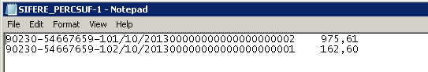

1

## Objetivo

El presente manual tiene por objetivo explicar las configuraciones necesarias
para la emisión del aplicativo Si.Fe.Re. Convenio Multilateral.

Dicho aplicativo busca informar los importes inherentes a retenciones y
percepciones sufridas Impuesto sobre los Ingresos Brutos que tributan por
Convenio Multilateral en un período determinado.

Se podrán emitir los siguientes archivos:

-   Retenciones de Ingresos Brutos Sufridas

-   Percepciones de Ingresos Brutos Sufridas

-   Retenciones Bancarias Sufridas

-   Percepciones Aduaneras Sufridas

## Retenciones de Ingresos Brutos Sufridas

Los campos que integran el archivo son los siguientes:

-   *Código de Jurisdicción:* es la jurisdicción dada de alta en el aplicativo
    para la clase de comprobante aplicable a la retención.

    Para las retenciones el dato se toma del formulario Aplicativos de la Clase
    de comprobante. El formulario está ubicado en **LATAM → CLASE DE
    COMPROBANTE.**

    ****

    

    *Nota 1: se aclara que se podrá configurar un aplicativo para diferenciar y
    poder tomar los códigos de comprobantes, jurisdicciones, tipo de documentos,
    etc. Asegúrese de crear un Id de Aplicativo por cada Archivo Magnético que
    necesite.*

    *Nota 2: se aclara que a nivel de configuración requiere la creación de un
    comprobante valor de tipo retención para cada jurisdicción de Ingresos
    Brutos sufrida por la compañía.*

    *Nota 3: no se recomienda utilizar comprobantes de retención creados y
    utilizados en los Pagos a Proveedores.*

-   *CUIT del Agente de Retención:* es el número de identificación de País
    (CUIT) del cliente que ha realizado la Retención.

    Este campo se toma del maestro Clientes, ubicado en la Solapa Latam

    **

-   *Fecha de la Retención:* se trata de la fecha del Certificado de Retención.
    Este campo se obtiene del tab LATAM de la línea que representa la Retención
    Sufrida, Fecha de Documento.

    Las transacciones se ingresarán mediante el diario ubicado en **TESORERIA →
    DIARIO DE RECIBO DE EFECTIVO.**

    ****

    *Nota: debe asegurarse que al cargar la transacción se coloque allí la fecha
    que figura en el Certificado de Retención.*

-   *Número de Sucursal:* es el campo Punto de Venta que figura para la clase de
    comprobante de la línea de Retención.

    

    *Nota 1:* *debe asegurarse que al cargar la transacción se coloque allí la
    sucursal que figura en el Certificado de Retención.*

    *Nota 2: se recomienda que el comprobante que representa la retención se
    encuentre configurado con numeración manual y habilitado para el ingreso del
    punto de venta o sucursal. De no tener sucursal, se recomienda completar con
    ceros, el campo.*

-   *Número de constancia:* se trata del campo Número de Comprobante que figura
    para la clase de comprobante de la línea de Retención.

    ****

    *Nota 1:* *debe asegurarse que al cargar la transacción se coloque allí el
    número de certificado que figura en el comprobante entregado por el
    cliente.*

    *Nota 2: se recomienda que el comprobante que representa la retención se
    encuentre configurado con numeración manual.*

-   *Tipo de Comprobante (F, R, D, C, O):* es un campo que diferencie los Tipos
    de Clase de comprobantes. Para este archivo, será necesario configurar en la
    clase de comprobante que represente el Recibo o Cobro (Comprobante No
    Valor), en el Botón Aplicativo, el Tipo de comprobante que se requiere. Para
    el Caso del Recibo será ‘R’.

    ****

    *Nota 1: se aclara que se podrá configurar un aplicativo para diferenciar y
    poder tomar los códigos de comprobantes, jurisdicciones, tipo de documentos,
    etc. Asegúrese de crear un Id de Aplicativo por cada Archivo Magnético que
    necesite.*

    *Nota 2:*

    -   F= Factura

    -   R= Recibo

    -   D= Nota de Debito

    -   C= Nota de Crédito

    -   O= Otros

-   *Letra del Comprobante:* es la Letra del Comprobante configurada en el
    comprobante que represente el Recibo o Cobro (Comprobante No Valor), en el
    Botón Aplicativo. Para el caso del Recibo será ‘C’.

*Nota: se aclara que se podrá configurar un aplicativo para diferenciar y poder
tomar los códigos de comprobantes, jurisdicciones, tipo de documentos, etc.
Asegúrese de crear un Id de Aplicativo por cada Archivo Magnético que necesite.*

-   *Número de Comprobante Original***:** es el campo Número de Comprobante del
    comprobante que representa el Recibo o Cobro (Comprobante No Valor). Debe
    asegurarse que al cargar la transacción se coloque allí el número de Recibo
    o Cobro.

    

    *Nota: en general este comprobante se encuentra configurado con numeración
    automática por lo que al registrar se asigna la numeración.*

-   *Importe Retenido:* es el importe que figura sobre la línea de Retención.
    Este importe debe ingresarse en la transacción a partir del comprobante
    entregado por el Cliente.

    ****

## Configuración del Reporteador de Impuestos

A efectos de la generación del Archivo de Retenciones de Ingresos Brutos
Sufridas será necesaria la confección de un formato de reporte para esta salida
en el formulario ubicado en **CONFIGURACION → LATAM CONFIGURACION DE REPORTES →
REPORTES DE IMPUESTOS.**

****

**Solapa General**

Los campos a completar son los siguientes:

-   *N°:* en este campo se deberá completar el código de identificación del
    reporte que se está parametrizando. Por ejemplo, SIF-RETSUF.

-   *Descripción:* en este campo se deberá completar el NOMBRE LEGAL del
    reporte. Es muy importante este campo, ya que será la denominación legal que
    se imprimirá en el reporte. Por ejemplo, SIFERE- RETENCIONES SUFRIDAS.

Dentro de Acciones se podrán configurar las siguientes solapas

**Solapa Secciones**

Los campos a completar son los siguientes:

-   *Orden 1, 2, 3:* establecerá el orden en el que se mostrarán los
    comprobantes en el aplicativo.

-   *Grupo de clase de comprobante:* en este campo se deberá seleccionar los
    conjuntos de comprobantes previamente configurados en el formulario Latam
    Lista de grupos de clase de comprobante. Dichos conjuntos deberán contener
    aquellos comprobantes que representen Retenciones sufridas de Ingresos
    brutos en los cobros.

-   *Nombre:* este campo ampliará con una descripción el código indicado en el
    campo ‘Id. de conjunto de comprobantes’. No es un campo editable.

-   *Nombre para mostrar:* este campo se utilizará para asignar el nombre del
    conjunto que deberá visualizarse en el reporte. En caso de estar en blanco,
    en el reporte saldrá vacío.

-   *Invertir el signo:* por cada conjunto de comprobantes se podrá determinar
    si en la visualización del reporte se debe invertir el signo. No será
    necesario marcar para este Archivo.

-   *Filtrar por:* este campo permite seleccionar una de las opciones de
    filtrado que se aplicarán sobre el conjunto de comprobantes seleccionado. La
    opción recomendada es:

-   Sin filtro: no tiene en cuenta ninguna de las columnas siguientes.

Solapa Columnas

Para el aplicativo SIFERE Retenciones Sufridas, se deberá configurar una columna
en el reporte impositivo, de la siguiente manera:

-   *Columna 1:* Monto de la Retención

    Esta columna deberá configurarse para mostrar el importe de las retenciones
    a informar. Por ese motivo, en la grilla de Conjunto de impuestos por
    columna, se deberá configurar como ‘Retención: Monto’*, con su ID de grupo
    de retenciones que contenga todos los códigos de retención de IIBB de las
    jurisdicciones que nos realizan retención*

**

**

**Solapa General**

Los campos a completar son los siguientes:

-   *Ordenar por:* este campo permite indicar el orden a tomar en los
    documentos. Se recomienda la opción ‘Fecha + Comprobante + Número de
    documento’

-   *Cantidad de decimales:* este campo permite indicar la cantidad de decimales
    a mostrar en los campos de Tipo monto. Se recomienda colocar 2 decimales.

-   *Separados de miles:* este campo permite indicar el separador de miles a
    utilizar en el reporte a emitir, no del archivo. El archivo tomará como
    separador de miles el Punto (.)

-   *Separador de decimales:* este camp permite indicar el separador de
    decimales a utilizar en el reporte a emitir, no del archivo. El archivo
    tomará como separador de decimales la Coma (,).

**Solapa de Formato**

Se recomienda asignar un formato de reporte a efectos de poder visualizar la
información ingresada y controlar el contenido de lo informado en el Archivo.

## Percepciones de Ingresos Brutos Sufridas

Los campos que integran el archivo son los siguientes:

-   *Código de Jurisdicción:* es la jurisdicción dada de alta en el aplicativo
    para el código de impuestos que represente la percepción.

    Para las percepciones el dato se toma del formulario Aplicativos del Código
    de impuesto. El formulario está ubicado en **JURISDICCIONES FISCALES → LATAM
    → APLICATIVO DE IMPUESTO.**

**

**

*Nota 1: se aclara que se podrá configurar un aplicativo para diferenciar y
poder tomar los códigos de comprobantes, jurisdicciones, tipo de documentos,
etc. Asegúrese de crear un Id de Aplicativo por cada Archivo Magnético que
necesite.*

*Nota 2: se aclara que a nivel de configuración requiere la creación de un
código de impuestos (Percepción sufrida) para cada jurisdicción de Ingresos
Brutos.*

-   *CUIT del Agente de Percepción:* es el número de identificación de País
    (CUIT) del proveedor que ha realizado la Percepción.

    Este campo se toma del maestro Proveedores, ubicado en la Solapa Latam

****

-   *Fecha de la Percepción:* se trata de la fecha de la transacción en la cual
    se ha registrado la Percepción, es decir la fecha de contabilización.

****

-   *Número de Sucursal:* es el campo Punto de Venta que figura sobre la línea
    del comprobante en donde se encuentra la Percepción. Debe asegurarse que al
    cargar la transacción se coloque allí la sucursal o Punto de Venta que
    figura en el comprobante entregado por el proveedor.

*Nota: el comprobante que representa la Factura del Proveedor debería
configurarse con numeración manual y poseer habilitado el ingreso del punto de
venta o sucursal.*

-   *Número de constancia:* se trata del campo Número de Comprobante que
    contiene la Percepción, como por ejemplo Factura. Debe asegurarse que al
    cargar la transacción se coloque allí el número de comprobante que ha
    entregado el proveedor.

****

*Nota: el comprobante que representa la Factura del Proveedor debería
configurarse con numeración manual y poseer habilitado el ingreso del punto de
venta o sucursal.*

-   *Tipo de Comprobante (F, R, D, C, O):* es un campo que diferencie los Tipos
    de Comprobantes. Para este archivo, será necesario configurar en el
    comprobante que contenga la Percepción, posea en el Botón aplicativo, el
    tipo de comprobante que se requiere. Para el caso de Factura, por ejemplo,
    será ‘F’.

*Nota: se aclara que se podrá configurar un aplicativo para diferenciar y poder
tomar los códigos de comprobantes, jurisdicciones, tipo de documentos, etc.
Asegúrese de crear un Id de Aplicativo por cada Archivo Magnético que necesite.*

-   *Letra del Comprobante:* es la Letra del Comprobante que contiene la
    Percepción. Se deberá configurar a través del botón Aplicativo. Por ejemplo,
    ‘A’.

*Nota: se aclara que se podrá configurar un aplicativo para diferenciar y poder
tomar los códigos de comprobantes, jurisdicciones, tipo de documentos, etc.
Asegúrese de crear un Id de Aplicativo por cada Archivo Magnético que necesite.*

-   *Importe Percibido:* es el importe de la Percepción. Para poder tomar el
    importe correcto de la Percepción se requiere tener configurado un Código de
    Impuesto por cada Percepción de Ingresos Brutos de cada jurisdicción.
    Adicionalmente debe asegurarse que, a nivel de la transacción, dicho código
    de impuesto, se encuentre asignado para que la Percepción se calcule y
    queden los datos relacionados a la transacción.

## Configuración del Reporteador de Impuestos

A efectos de la generación del archivo de Percepciones de Ingresos Brutos
Sufridas será necesaria la confección de un formato de reporte para esta salida
en el formulario ubicado en **CONFIGURACION → LATAM CONFIGURACION DE REPORTES →
REPORTES DE IMPUESTOS.**

****

Los campos a completar son los siguientes:

-   *N°:* en este campo se deberá completar el código de identificación del
    reporte que se está parametrizando. Por ejemplo, SIF-PERCSUF.

-   *Descripcion:* en este campo se deberá completar el NOMBRE LEGAL del
    reporte. Es muy importante este campo, ya que será la denominación legal que
    se imprimirá en el reporte. Por ejemplo, SIFERE- PERCEPCIONES SUFRIDAS.

Dentro de Acciones se podrán configurar las siguientes solapas

**

**Solapa Secciones**

Los campos a completar son los siguientes:

-   *Orden 1, 2, 3:* establecerá el orden en el que se mostrarán los
    comprobantes en el aplicativo.

-   *Grupo de comprobante:* en este campo se deberá seleccionar los conjuntos de
    comprobantes previamente configurados en el formulario Latam Lista de grupos
    de clase de comprobante.. Dichos conjuntos deberán aquellos contener
    comprobantes que representen Percepciones sufridas de Ingresos Brutos en las
    compras.

*Nota: se recomienda colocar en un mismo conjunto todos los comprobantes,
incluyendo las Notas de Crédito, ya que éstas se deberán informar con su signo
original (negativo).*

-   *Nombre:* este campo ampliará con una descripción el código indicado en el
    campo ‘Id. de conjunto de comprobantes’. No es un campo editable.

-   *Nombre para mostrar:* este campo se utilizará para asignar el nombre del
    conjunto que deberá visualizarse en el reporte. En caso de estar en blanco,
    en el reporte saldrá vacío.

-   *Invertir el signo:* por cada conjunto de comprobantes se podrá determinar
    si en la visualización del reporte se debe invertir el signo. No será
    necesario marcar para este Archivo.

-   *Filtrar por:* este campo permite seleccionar una de las opciones de
    filtrado que se aplicarán sobre el conjunto de comprobantes seleccionado. La
    opción recomendada es:

-   Sin filtro: no tiene en cuenta ninguna de las columnas siguientes.

**Solapa Columnas**

Para el aplicativo SIFERE Percepciones Sufridas, se deberá configurar dos
columnas en el reporte impositivo, de la siguiente manera:

-   *Columna 1:* Monto de la Percepción.

    Esta columna deberá configurarse para mostrar el importe de las percepciones
    a informar. Por ese motivo, en la grilla de Conjunto de impuestos por
    columna, se deberá configurar como ‘Impuesto: Monto’.

-   *Columna 2:* Total

    Esta columna deberá configurarse para mostrar sólo las transacciones que
    posean los códigos de impuestos configurados en la columna 1, y configurarla
    como ‘Excluir Comprobante en Cero’ (ver imagen arriba). En la grilla
    inferior deberá seleccionar ‘Impuesto: Monto Sujeto’ con el conjunto de
    comprobantes seleccionado en la Columna 1.

**  
**

**Solapa General**

Los campos a completar son los siguientes:

-   *Ordenar por:* este campo permite indicar el orden a tomar en los
    documentos. Se recomienda la opción ‘Fecha + Comprobante + Número de
    documento’

-   *Cantidad de decimales:* este campo permite indicar la cantidad de decimales
    a mostrar en los campos de Tipo monto. Se recomienda colocar 2 decimales.

-   *Separados de miles:* este campo permite indicar el separador de miles a
    utilizar en el reporte a emitir, no del archivo. El archivo tomará como
    separador de miles el Punto (.)

-   *Separador de decimales:* este camp permite indicar el separador de
    decimales a utilizar en el reporte a emitir, no del archivo. El archivo
    tomará como separador de decimales la Coma (,).

**Solapa de Formato**

Se recomienda asignar un formato de reporte a efectos de poder visualizar la
información ingresada y controlar el contenido de lo informado en el Archivo.

## Retenciones de Ingresos Brutos de Banco Sufridas

Los campos que integran el archivo son los siguientes:

-   *Código de Jurisdicción:* es la jurisdicción dada de alta en el aplicativo
    para el código de impuesto aplicable a la retención. Las retenciones
    bancarias, se configuran como códigos de impuestos, ya que las mismas se ven
    reflejadas en el ingreso del resumen bancario.

    Para este caso en particular el dato se toma del formulario Aplicativos de
    Códigos de Impuestos. El formulario está ubicado en **IMPUESTOS \>\>
    IMPUESTOS INDIRECTOS\>\> IMPUESTOS \>\> CÓDIGOS DE IMPUESTOS SOBRE LAS
    VENTAS \>\> BOTON LATAM \>\> APLICATIVOS.**

*Nota 1: se aclara que se podrá configurar un aplicativo para diferenciar y
poder tomar los códigos de comprobantes, jurisdicciones, tipo de documentos,
etc. Asegúrese de crear un Id de Aplicativo por cada Archivo Magnético que
necesite.*

*Nota 2: se aclara que a nivel de configuración requiere la creación de un
código de Impuestos que represente la Retención que realiza el Banco para cada
jurisdicción de Ingresos Brutos.*

-   *CUIT del Agente de Recaudación:* es el número de identificación de País
    (CUIT) del Banco que ha realizado la Retención.

    Los bancos deberán crearse como Proveedores. Si se posee más de una cuenta
    bancaria en un mismo Banco, se recomienda crear dos proveedores. Este campo
    se toma del maestro Proveedores, ubicado en la Solapa Latam.

****

-   *Período de Retención:* se trata de la fecha del Comprobante de Banco. Este
    campo se obtiene del tab LATAM de la línea que representa la Retención
    Sufrida, Fecha de Documento. A partir de ese dato se informará el Mes y el
    Año.

****

-   *CBU:* este campo se deberá configurar en el maestro del Proveedor que
    represente al banco. En la información adicional de Cuentas Bancarias,
    dentro del campo IBAN.

****

****

-   *Tipo de Cuenta (CA, CC, OO):* deberá asociarse en el maestro de Proveedor
    que represente al Banco. El campo a utilizarse será Código de Propósito del
    Banco Central, en el correspondiente maestro se deberán crear los siguientes
    códigos:

-   CA = Caja de Ahorro

-   CC= Cuenta Corriente

-   OO= Otros

    El Id del Propósito del Banco Central, deberá ser igual al Id que se deba
    indicar en el Archivo.

    

-   *Tipo de Moneda (P, E, O):* es la moneda predeterminada en el maestro de
    Proveedor que represente al Banco. Para informar el código solicitado por el
    Aplicativo, será necesario configurar en el Botón Aplicativo del maestro de
    Monedas el código correspondiente:

    -   P= Pesos

    -   E= Moneda Extranjera

    -   O= Otros

        El formulario está ubicado en **INFORMACION DE EMPRESA → CONFIGURACION
        DE LA APLICACIÓN → CONFIGURACION DE CONTABILIDAD → ACCIONES → LATAM →
        APLICATIVO DE IMPUESTOS**

        ****

        ****

-   *Importe Retenido:* es el importe de la Retención (Código de Impuesto). Para
    poder tomar el importe correcto de la Retención se requiere tener
    configurado un Código de Impuesto por cada Retención de Ingresos Brutos de
    Banco por cada jurisdicción. Adicionalmente debe asegurarse que, a nivel de
    la transacción, dicho código de impuesto, se encuentre asignado para que se
    calcule y queden los datos relacionados a la transacción.

## Configuración del Reporteador de Impuestos

A efectos de la generación del Archivo de Retenciones de Banco Sufridas será
necesaria la confección de un formato de reporte para esta salida en el
formulario ubicado en **CONFIGURACION → LATAM CONFIGURACION DE REPORTES →
REPORTE DE IMPUESTOS**

****

****

Los campos a completar son los siguientes:

-   *N°:* en este campo se deberá completar el código de identificación del
    reporte que se está parametrizando. Por ejemplo, SIF-RETBCO.

-   *Descripcion:* en este campo se deberá completar el NOMBRE LEGAL del
    reporte. Es muy importante este campo, ya que será la denominación legal que
    se imprimirá en el reporte. Por ejemplo, SIFERE- RETENCIONES BANCARIAS.

    ****

Dentro de Acciones se podrán configurar las siguientes solapas:

**Solapa Secciones**

Los campos a completar son los siguientes:

-   *Orden 1, 2, 3:* establecerá el orden en el que se mostrarán los
    comprobantes en el aplicativo.

-   *Grupo de clase de comprobante:* en este campo se deberá seleccionar los
    conjuntos de comprobantes previamente configurados en el formulario LATAM
    Lista de grupos de clase de comprobante. Puede crearse una clase de
    comprobante resumen bancario, con las mismas parametrizaciones de una
    Factura, o puede utilizarse el comprobante Factura para cargar los datos del
    resumen bancario con las retenciones bancarias.

    

-   *Descripcion:* este campo ampliará con una descripción el código indicado en
    el campo ‘Id. de conjunto de comprobantes’. No es un campo editable.

-   *Nombre para mostrar:* este campo se utilizará para asignar el nombre del
    conjunto que deberá visualizarse en el reporte. En caso de estar en blanco,
    en el reporte saldrá vacío.

-   *Invertir el signo:* por cada conjunto de comprobantes se podrá determinar
    si en la visualización del reporte se debe invertir el signo. No será
    necesario marcar para este Archivo.

-   *Filtrar por:* este campo permite seleccionar una de las opciones de
    filtrado que se aplicarán sobre el conjunto de comprobantes seleccionado. La
    opción recomendada es:

-   Sin filtro: no tiene en cuenta ninguna de las columnas siguientes.

    **Solapa Columnas**

    Para el aplicativo SIFERE Retenciones Bancarias, se deberá configurar dos
    columnas en el reporte impositivo, de la siguiente manera:

    

-   *Columna 1:* Monto de la Retención de Banco.

    Esta columna deberá configurarse para mostrar el importe de las retenciones
    a informar. Por ese motivo, en la grilla de Conjunto de impuestos por
    columna, se deberá configurar como ‘Impuesto: Monto’.

    **

-   *Columna 2:* Total

    Esta columna deberá configurarse para mostrar sólo las transacciones que
    posean los códigos de impuestos configurados en la columna 1, y configurarla
    como ‘Excluir Comprobante en Cero’. En la grilla inferior deberá seleccionar
    ‘Impuesto: Monto Sujeto’ con el conjunto de comprobantes seleccionado en la
    Columna 1.

    

**  
**

**Solapa General**

Los campos a completar son los siguientes:

-   *Ordenar por:* este campo permite indicar el orden a tomar en los
    documentos. Se recomienda la opción ‘Fecha + Comprobante + Número de
    documento’

-   *Cantidad de decimales:* este campo permite indicar la cantidad de decimales
    a mostrar en los campos de Tipo monto. Se recomienda colocar 2 decimales.

-   *Separados de miles:* este campo permite indicar el separador de miles a
    utilizar en el reporte a emitir, no del archivo. El archivo tomará como
    separador de miles el Punto (.)

-   *Separador de decimales:* este camp permite indicar el separador de
    decimales a utilizar en el reporte a emitir, no del archivo. El archivo
    tomará como separador de decimales la Coma (,).

    **Solapa de Formato**

    Se recomienda asignar un formato de reporte a efectos de poder visualizar la
    información ingresada y controlar el contenido de lo informado en el
    Archivo.

    

**  
**

## Percepciones de Ingresos Brutos Aduana Sufridas

Los campos que integran el archivo son los siguientes:

-   *Código de Jurisdicción:* es la jurisdicción dada de alta en el aplicativo
    para el código de impuestos que represente la percepción.

    Para las percepciones el dato se toma del formulario Aplicativos del Código
    de impuesto. El formulario está ubicado en **JURISDICCIONES FISCALES → LATAM
    → APLICATIVO DE IMPUESTO.**

    

    

    *Nota 1: se aclara que se podrá configurar un aplicativo para diferenciar y
    poder tomar los códigos de comprobantes, jurisdicciones, tipo de documentos,
    etc. Asegúrese de crear un Id de Aplicativo por cada Archivo Magnético que
    necesite.*

    *Nota 2: se aclara que a nivel de configuración requiere la creación de un
    código de Impuestos de Aduana (Percepción sufrida) para cada jurisdicción de
    Ingresos Brutos.*

    

-   *CUIT del Agente de Percepción:* es el número de identificación de País
    (CUIT) del proveedor que ha realizado la Percepción.

    La Aduana deberá crearse como un proveedor. Este campo se toma del maestro
    Proveedores, ubicado en la Solapa Latam

    

    *Nota: el cuit a informar es SOLO el de la Aduana*

-   *Fecha de la Percepción:* se trata de la Fecha de la Transacción en la cual
    se ha registrado la Percepción, es decir la fecha de Registro.

****

-   *Número de Despacho Aduanero:* se trata del campo Número de Comprobante que
    contiene la Percepción, como por ejemplo Despacho. Debe asegurarse que al
    cargar la transacción se coloque allí el número de despacho.

    ****

    *Nota: el comprobante que representa el despacho debería configurarse con
    numeración manual.*

-   *Importe Percibido:* es el importe de la Percepción de Aduana. Para poder
    tomar el importe correcto de la Percepción de Aduana se requiere tener
    configurado un Código de Impuesto por cada Percepción de Ingresos Brutos
    para Aduana por cada jurisdicción. Adicionalmente debe asegurarse que, a
    nivel de la transacción, dicho código de impuesto, se encuentre asignado
    para que la Percepción se calcule y queden los datos relacionados a la
    transacción.

    ****

## Configuración del Reporteador de Impuestos

A efectos de la generación del Archivo de Percepciones de Aduana Sufridas será
necesaria la confección de un formato de reporte para esta salida en el
formulario ubicado en **CONFIGURACION → LATAM CONFIGURACION DE REPORTES →
REPORTE DE IMPUESTO.**

****

**Solapa general**

Los campos a completar son los siguientes:

-   *N°:* en este campo se deberá completar el código de identificación del
    reporte que se está parametrizando. Por ejemplo, SIF-PERCADA.

-   *Descripcion:* en este campo se deberá completar el NOMBRE LEGAL del
    reporte. Es muy importante este campo, ya que será la denominación legal que
    se imprimirá en el reporte. Por ejemplo, SIFERE- PERCEPCIONES ADUANAS.

Dentro de Acciones se podrán configurar las siguientes solapas:

**Solapa Secciones**

Los campos a completar son los siguientes:

-   *Orden 1, 2, 3:* establecerá el orden en el que se mostrarán los
    comprobantes en el aplicativo.

-   *Grupo de clase de comprobante:* en este campo se deberá seleccionar los
    conjuntos de comprobantes previamente configurados en el formulario LATAM
    Lista de grupos de clase de comprobante. Dichos conjuntos deberán contener
    aquellos comprobantes que representen Percepciones sufridas de aduanas.

-   *Descripcion:* este campo ampliará con una descripción el código indicado en
    el campo ‘Id. de conjunto de comprobantes’. No es un campo editable.

-   *Nombre para mostrar:* este campo se utilizará para asignar el nombre del
    conjunto que deberá visualizarse en el reporte. En caso de estar en blanco,
    en el reporte saldrá vacío.

-   *Invertir el signo:* por cada conjunto de comprobantes se podrá determinar
    si en la visualización del reporte se debe invertir el signo. No será
    necesario marcar para este Archivo.

-   *Filtrar por:* este campo permite seleccionar una de las opciones de
    filtrado que se aplicarán sobre el conjunto de comprobantes seleccionado. La
    opción recomendada es:

-   Sin filtro: no tiene en cuenta ninguna de las columnas siguientes.

**Solapa Columnas**

Para el aplicativo SIFERE Percepciones Sufridas de Aduana, se deberá configurar
dos columnas en el reporte impositivo, de la siguiente manera:

-   *Columna 1:* Monto de la Percepción de Aduana.

    Esta columna deberá configurarse para mostrar el importe de las percepciones
    a informar. Por ese motivo, en la grilla de Conjunto de impuestos por
    columna, se deberá configurar como ‘Impuesto: Monto’.

-   *Columna 2:* Total

    Esta columna deberá configurarse para mostrar sólo las transacciones que
    posean los códigos de impuestos configurados en la columna 1, y configurarla
    como ‘Excluir Comprobante en Cero’. En la grilla inferior deberá seleccionar
    ‘Impuesto: Monto Sujeto’ con el conjunto de comprobantes seleccionado en la
    Columna 1.

**Solapa General**

Los campos a completar son los siguientes:

-   *Ordenar por:* este campo permite indicar el orden a tomar en los
    documentos. Se recomienda la opción ‘Fecha + Comprobante + Número de
    documento’

-   *Cantidad de decimales:* este campo permite indicar la cantidad de decimales
    a mostrar en los campos de Tipo monto. Se recomienda colocar 2 decimales.

-   *Separados de miles:* este campo permite indicar el separador de miles a
    utilizar en el reporte a emitir, no del archivo. El archivo tomará como
    separador de miles el Punto (.)

-   *Separador de decimales:* este camp permite indicar el separador de
    decimales a utilizar en el reporte a emitir, no del archivo. El archivo
    tomará como separador de decimales la Coma (,).

**Solapa de Formato**

Se recomienda asignar un formato de reporte a efectos de poder visualizar la
información ingresada y controlar el contenido de lo informado en el Archivo.

## Definición de exportación de medios magnéticos

Una vez realizada la configuración general para cada archivo será necesario
configurar específicamente la exportación de los archivos, en el formulario
ubicado en **CONFIGURACION → LATAM CONFIGURACION DE REPORTES → DEFINICIÓN DE
MEDIOS MAGNÉTICOS.**

****

****

Se deberá configurar un registro por cada salida. Los campos a completar son los
siguientes:

**Solapa General**

****

**Solapa general**

-   *ID Medio Magnetico:* es la identificación del código para exportación del
    archivo magnético. Se recomienda utilizar un código que el usuario que
    exportará el archivo, pueda distinguir.

-   *Descripción:* ingrese una descripción sobre el Tipo de Archivo a Exportar.

**Solapa configuración**

-   *Aplicativo de impuesto:* este campo permite seleccionar el código de
    aplicativo, previamente creado en el correspondiente maestro. Cabe destacar
    que este código también se recomienda crearlo con el mismo nombre que el del
    reporte impositivo. Este dato, le indicará al archivo de exportación qué ID
    de aplicativo tomar, para informar, en el caso de los campos que necesitan
    ser mapeados, como ser Tipos de comprobantes, Jurisdicciones, Monedas, etc.

-   *Aplicativo de impuesto secundario*

-   *Reporte de impuesto*

-   *Reporte ID:* este campo permite seleccionar el código de reporte impositivo
    creado de acuerdo a lo visto en pasos anteriores.

-   *Nombre del reporte:* este campo está vinculado al reporte elegido en el
    campo anteriormente mencionado.

**Parámetros**

-   *Parámetros:* en esta grilla se deberán agregar las distintas etiquetas que
    hacen al nombre del archivo a exportar y el tipo de extensión del archivo.

-   Nombre: SIFERE_PERCADA

-   Extensión: .txt

-   *Nombre del archivo:* en este campo se deberán concatenar los campos Nombre
    creados en la grilla Parámetros, precedidos por el símbolo \$ y sin espacios
    entre ellos.

-   *Nombre de archivo traducido:* este campo no es editable, solo tomará los
    campos Valor creados en la grilla Parámetros.

## Exportación de medios magnéticos

Desde este formulario se emitirá el archivo y se determinará dónde debe
guardarse, se puede acceder mediante el formulario ubicado **INFORMES → INFORMES
FINANACIEROS →LATAM MEDIOS MAGNETICOS → EXPORTACIÓN DE MEDIOS MAGNÉTICOS.**

Los campos a completar son los siguientes:

-   *ID Medio Magnetico:* aquí se deberá seleccionar el ID de Exportación,
    configurado en el formulario Definición de exportación de medios magnéticos.

-   *Fecha desde:* es la fecha inicial a partir de la cual se mostrará la
    información. Será la fecha de Registración de las Transacciones.

-   *Fecha hasta:* es la fecha final hasta la cual se mostrará la información.
    Será la fecha de Registración de las Transacciones.

    Nota: al clickear Aceptar, se abre un pop up que nos indicará si deseamos
    abrir o guardar el archivo, y la ubicación que daremos al mismo.

    

    Una vez finalizado el proceso de exportación, se mostrará la siguiente
    ventana:

    

    **Ejemplos de Archivos exportados**

    SIFERE Percepciones Aduaneras:

    ****

    SIFERE Percepciones Sufridas:

    ****

    SIFERE Retenciones Bancarias:

    ****

    SIFERE Retenciones Sufridas:

    
