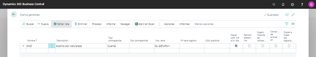
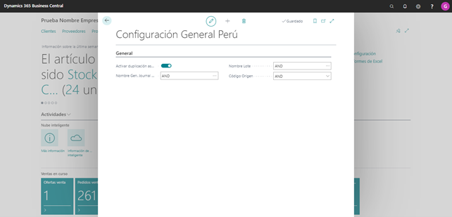
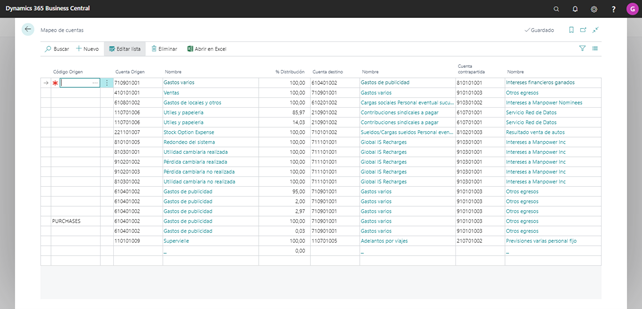

Contenido
BC Asiento por Naturaleza y Destino	3
Objetivo	3
Requisitos	3
Configuración General Peru:	5
Mapeo de cuentas	6
 
##Objetivo 

Este formulario permitirá incorporar las parametrizaciones generales que deberá hacerse a la localización para poder duplicar los asientos contables de determinadas cuentas de gastos y costos para armar un asiento en paralelo que cubra las necesidades de registración y presentación de Perú.  
Para realizar la correspondiente configuración ingresar al formulario, debiendo seleccionar desde el panel de navegación del menú FINANZAS → DIARIOS GENERAL → AND. 
  

##Requisitos
Para poder generar los asientos, antes se deberá tener configurado los siguientes requisitos

* Cuentas contables: Se deberá tener configuradas las cuentas contables del Plan de cuentas, como también las cuentas contables en las que se duplicaran los asientos.
Esta configuración se realizará desde la ventana del plan de cuentas estándar de BC.
(Finanzas → Plan de Cuentas)  

 

* Libro de Diario General: Dar de alta en el Libro de Diario General, el diario sobre el cual se registrará el asiento de duplicación.  
Será necesaria la creación de un Diario, que exclusivamente se utilice para esta funcionalidad. Para ello cree el diario en la siguiente ruta: Finanzas → Diario general → +Nuevo

   Este diario deberá tener los siguientes parámetros:
    * Nombre: AND
    * Descripcion: Asiento por Naturaleza y Destino
    * Tipo: General
    * Código de Origen: Será necesario crear un código de origen especial, para poder identificarlo
    * Serie: será necesario crear un número de serie con un prefijo alfabético para poder identificar dentro del sistema este tipo de asientos. La serie deberá ser continua.
 

* Configurar la sección referente al diario dado de alta (Secciones del Libro de Contabilidad)- Finanzas → Diario general → Seleccionar el Diario creado → Navegar → Diario General periódico
 

#Configuración General Peru

Para realizar la correspondiente configuración se deberá ingresar al formulario, debiendo seleccionar desde el panel de navegación del menú  LATAM → CONFIGURACION → CONFIGURACION GENERAL PERU.

 

Los campos contemplados en este formulario son los siguientes: 

* **Activar Duplicación asiento GL:** Dentro de este menú, agregar campo ‘Activar Duplicación Asiento’, Si o No como opciones. 
Sí el campo se encuentra con la opción SI, es decir se activa la duplicación, se habilita el próximo campo de este menú, ‘Nombre de diario’.
* **Nombre Diario General:** En este campo, se deberán mostrar los Libros de Diario general que tengan configurado el Tipo ‘General’  y que contengan en el campo Source Code, un código de Origen específico.
* **Nombre Lote:** este campo se completara automáticamente, una vez seleccionado el Diario general
* **Codigo Origen:** este campo se completara automáticamente, una vez seleccionado el Diario general

#Mapeo de cuentas

Este formulario permite configurar las cuentas contables de origen, cuentas contables destino y cuenta contable de contrapartida, para los asientos duplicados o adicionales.

Para realizar la correspondiente configuración se deberá ingresar al formulario, debiendo seleccionar desde el panel de navegación del menú  LATAM → CONFIGURACION → MAPEO DE CUENTAS

 
  
 
 
* **Codigo origen:** Este campo será lista desplegable, con exactamente las mismas opciones que tiene el Libro de Diario General   
Este campo puede quedar vacío. Si está vacío, significa que para la duplicación de asiento se buscará cualquier asiento que tenga la cuenta origen sin importar el tipo de diario o transacción.
Sí el usuario lo selecciona, significa que deberá buscar en la contabilidad, los asientos que tengan este tipo de diario, y además tengan la cuenta registrada, como cuenta origen en este formulario.
Este campo, junto con el de cuenta origen y % distribución, son la clave de este formulario; es decir, no puede haber en la grilla un mismo tipo de diario con una misma cuenta origen siempre que ya se tengan el 100% de distribución.

* **Cuenta origen:** Campo lista, que muestra el maestro de cuentas contables, para la compañía en la que estamos configurando el formulario. Es decir, solo debe mostrar las cuentas contables de la compañía sobre la que se está configurando. En el campo, al desplegar se debe visualizar el código de cuenta contable y su nombre o descripción. Solo debe mostrar las cuentas cuyo Tipo de Movimiento sea ‘Auxiliar’ (Cuenta no Totalizadora)

* **% Distribución:** los campos Tipo de diario más cuenta origen deben sumar el 100% en la configuración. Es decir, se puede tener una misma cuenta origen, que se debe duplicar en más de una cuenta destino con su % de distribución.

* **Cuenta destino:** Campo lista, que muestra el maestro de cuentas contables, para la compañía en la que estamos configurando el formulario. Es decir, solo debe mostrar las cuentas contables de la compañía sobre la que se está configurando. En el campo, al desplegar se debe visualizar el código de cuenta contable y su nombre o descripción. Solo debe mostrar las cuentas cuyo Tipo de Movimiento sea ‘Auxiliar’ (Cuenta no Totalizadora)
Sí se utilizan diferentes % de distribución para la misma cuenta origen, en este campo cuenta destino se debe validar que no se ingrese la misma cuenta destino ya ingresada para la misma cuenta origen.  

NOTA: En caso que, el usuario seleccione una cuenta contable, que tenga configurada en sus dimensiones, un valor o regla de registración, se advertirá que no puede seleccionarse. Solo se podrán seleccionar cuentas contables que no tengan valores de dimensiones obligatorios o registro de validación, ya que las cuentas destino toman los valores de su cuenta origen.

* **Cuenta contrapartida:** Campo lista, que muestra el maestro de cuentas contables, para la compañía en la que estamos configurando el formulario. Es decir, solo debe mostrar las cuentas contables de la compañía sobre la que se está configurando. En el campo, al desplegar se debe visualizar el código de cuenta contable y su nombre o descripción. Solo debe mostrar las cuentas cuyo Tipo de Movimiento sea ‘Auxiliar’ (Cuenta no Totalizadora).  

NOTA: En caso de que, el usuario seleccione una cuenta contable, que tenga configurada en sus dimensiones, un valor o regla de registración, se advertirá que no puede seleccionarse. Solo se podrán seleccionar cuentas contables que no tengan valores de dimensiones obligatorios o registro de validación, ya que las cuentas contrapartida toman los valores de su cuenta origen.

Cada vez que se registre en contabilidad un tipo de registro con su cuenta origen configurada y el campo Codigo de Origen, deberá generar un nuevo asiento contable, de acuerdo con el nombre de diario configurado en parámetros de Asiento por naturaleza y Destino, pero con la cuenta destino o cuentas destino en caso de % distribución diferente, y sus respectivas cuentas de contrapartida.

La cuenta destino y la cuenta contrapartida, deberá tomar las dimensiones que se hayan registrado en su cuenta origen.  Por lo tanto, las cuentas destino y contrapartida de Asiento por naturaleza y destino tienen que estar configuradas sin código valor dimensión y sin registro valor. 

Ejemplo 1: 
Tenemos configurado en el formulario Mapeo de cuentas lo siguiente:  

|Tipo de diario|Cuenta origen|% distribución|Cuenta destino|Cuenta contrapartida|
|---------------|---------------|---------------|---------------|--------------------|
 	||679311	|50|	921010	|791111|
 	||679311	|50|	951010	|791111|
 	||681111	|100|	921010	|781111|
|Purchases	|659311	|100	|941010	|791111|

Se registra una Factura de proveedor el siguiente asiento contable:

| | | ||
|------|-------------------|----------|-------------------------------------------|
|659311 |COMISIONES AGENTES| 		1,000 |
|421201 |FACTURAS POR PAGAR|                 |	1,000|

Una vez que esto se registró, inmediatamente LATAM debe registrar el siguiente asiento:

**Nombre de diario parámetros LATAM	**

|||||
|----|----|----|----|
|941010 |GASTOS |1,000.||
|791111 |CARGAS IMPUTABLES |                       | 1,000.|

Ejemplo 2: 
Tenemos configurado en el formulario Mapeo de cuentas lo siguiente:

|Tipo de diario|Cuenta origen|% distribución|Cuenta destino|Cuenta contrapartida|
|---------------|---------------|---------------|---------------|--------------------|
| 	|679311	|50	|921010	|791111|
| 	|679311	|50	|951010	|791111|
| 	|681111	|100	|921010	|781111|
|Purchases	|659311	|100	|941010	|791111|

Se registra por un Factura de Compra el siguiente asiento contable:

| | | ||
|------|-------------------|----------|-------------------------------------------|
|639311|CARGAS FINANCIERAS|1,000 ||
|421201|FACTURAS POR PAGAR|        	|1,000|

Una vez que esto se registró, inmediatamente LATAM debe registrar el siguiente asiento:

**Nombre de diario parámetros LATAM	**

| | | ||
|------|-------------------|----------|-------------------------------------------|
|921010 |COSTOS DEL SERVICIO| 			500.||
|951010 |GASTOS DE VENTAS|			500||
|791111 |CARGAS IMPUTABLES|             |            1,000|

El proceso deberá dejar plasmado en el asiento que originó una referencia de cuál fue su asiento de origen. 

Finanzas → Plan de cuentas → Proceso → Registro Movs contabilidad → Contabilidad

 

Como se ha mencionado, el proceso debe abarcar cualquier asiento contable que el sistema genere, a saber:

* Transacciones de Compras (incluye recepciones y cargas de documentos de proveedor como Facturas y Notas de Crédito/Devoluciones)
* Transacciones de Ventas (incluye envíos y cargas de documentos de proveedor como Facturas y Notas de Crédito/Devoluciones)
* Asientos producidos por los cargos adicionales en compras y ventas (item Charges)
* Transacciones de Tesorería (Ejemplo: Pagos, cobros, depósitos)
* Transacciones de Contabilidad (asientos contables)
* Cierre de Ejercicio
* Asientos automáticos de Diferencias de Cambio
* Asientos Automáticos por ajuste de Costos de ítems
* Transacciones de Inventario (diarios de conteo, ajustes positivos y negativos, ordenes de transferencias, transferencias)

