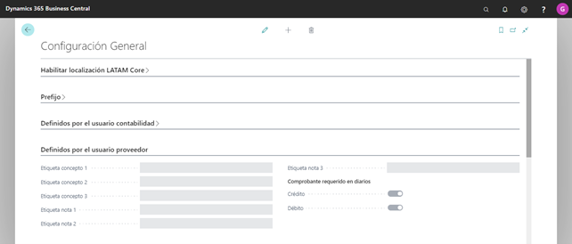
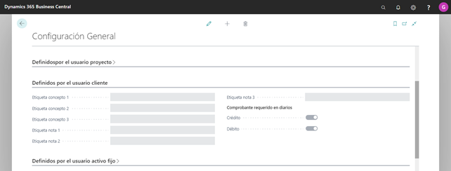
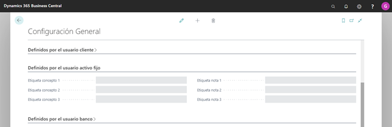
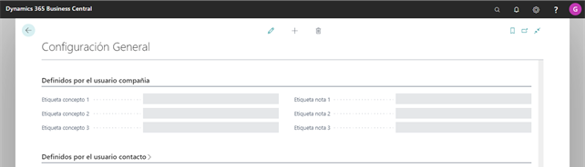
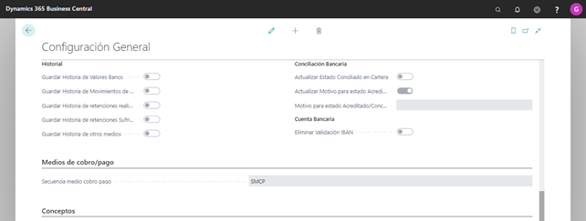

#Configuración General LATAM

##Objetivo

Este formulario permite incorporar las parametrizaciones generales que deberá hacerse a la localización, antes de comenzar con sus respectivas configuraciones.

Para realizar la correspondiente configuración se deberá ingresar al formulario, debiendo seleccionar desde el panel de navegación del menú  LATAM → CONFIGURACION → CONFIGURACION GENERAL.
###Habilitar localización LATAM Core

* Habilitar LATAM: este campo de verificación permitirá activar la localización.

###Prefijo

Los campos a completar son:

* Long. prefijo tipo clase comprobante: este campo deberá ser completado manualmente, indicando la cantidad de caracteres totales que se admitirán para el campo Prefijo del maestro de Tipo de clase de comprobante.

* Long. prefijo letra clase comprobante: este campo deberá ser completado manualmente, indicando la cantidad de caracteres totales que se admitirán para el campo Prefijo del maestro de Letra de clase de comprobante.

###Definidos por el usuario contabilidad

En esta sección se configurarán las etiquetas para definir los conceptos y notas que se utilizarán en los maestros de entidades. En el maestro, estos campos deberán visualizarse con la etiqueta configurada y a su vez, deberán permitir el ingreso de un cierto valor que agregara información adicional para la entidad. 

Los campos contemplados en este formulario son los siguientes: 

* Etiqueta concepto 1,2 y 3: serán campos alfanuméricos que permitirán guardar información adicional al momento de la carga de los sujetos. Se podrán configurar hasta tres conceptos, con una longitud máxima de 256 caracteres.  

* Etiqueta nota 1,2 y 3: serán campos alfanuméricos que permitirán guardar información adicional al momento de la carga de los sujetos. Se podrán configurar hasta tres notas, son de tipo memo.  

En esta sección también se permitirá configurar:
* Comprobante requerido en diarios: este campo permite configurar por Tipo de Cuenta y Tipo de Saldo, si el campo Comprobante, ubicado en la solapa LATAM de los Diarios será de carga obligatoria o no.
En caso de que el usuario cambie de débito a crédito o viceversa, si el comprobante NO se encuentra habilitado para trabajar en dicho tipo de saldo se borrará al igual que todos sus datos adicionales.
En líneas de Tipo Contabilidad (DEBITO o CREDITO): deberá habilitar los comprobantes cuyo Tipo de clase de comprobante coincida con el Tipo de Saldo cargado en la transacción. Este último, caso asumiendo que, previa carga del comprobante, se ha rellenado el monto en débito o crédito. De lo contrario se dejará en blanco, hasta tanto se complete el campo del importe.

###Definidos por el usuario proveedor

 

En este sección se configurarán las etiquetas para definir los conceptos y notas que se utilizarán en los maestros de entidades. En el maestro, estos campos deberán visualizarse con la etiqueta configurada y a su vez, deberán permitir el ingreso de un cierto valor que agregara información adicional para la entidad. 

Los campos contemplados en este formulario son los siguientes: 

* Etiqueta concepto 1,2 y 3: serán campos alfanuméricos que permitirán guardar información adicional al momento de la carga de los sujetos. Se podrán configurar hasta tres conceptos, con una longitud máxima de 256 caracteres.  

* Etiqueta nota 1,2 y 3: serán campos alfanuméricos que permitirán guardar información adicional al momento de la carga de los sujetos. Se podrán configurar hasta tres notas, son de tipo memo.  

En esta sección también se permitirá configurar:
* Comprobante requerido en diarios: en este seccion se permitirá configurar, por Tipo de Cuenta y Tipo de Saldo, si el campo Comprobante, ubicado en la solapa LATAM de los Diarios será de carga obligatoria o no.
En Líneas del Tipo Proveedor (DEBITO o CREDITO): en los diarios se mostrarán los comprobantes habilitados para dicho proveedor o cliente, cuyo Tipo de clase de comprobante se encuentre habilitado para el saldo cargado. Este último caso, asumiendo que previa carga del comprobante, se ha rellenado el monto en débito o crédito. De lo contrario quedará en blanco, hasta tanto se complete el campo del importe.
En caso de que el usuario cambie de débito a crédito o viceversa, si el comprobante NO se encuentra habilitado para trabajar en dicho tipo de saldo se borrará al igual que todos sus datos adicionales.

###Definidos por el usuario proyecto

En esta sección se configurarán las etiquetas para definir los conceptos y notas que se utilizarán en los maestros de entidades. En el maestro, estos campos deberán visualizarse con la etiqueta configurada y a su vez, deberán permitir el ingreso de un cierto valor que agregara información adicional para la entidad. 

Los campos contemplados en este formulario son los siguientes: 

* Etiqueta concepto 1,2 y 3: serán campos alfanuméricos que permitirán guardar información adicional al momento de la carga de los sujetos. Se podrán configurar hasta tres conceptos, con una longitud máxima de 256 caracteres.  

* Etiqueta nota 1,2 y 3: serán campos alfanuméricos que permitirán guardar información adicional al momento de la carga de los sujetos. Se podrán configurar hasta tres notas, son de tipo memo.  

En esta sección también se permitirá configurar:
* Comprobante requerido en diarios: en este seccion se permitirá configurar, por Tipo de Cuenta y Tipo de Saldo, si el campo Comprobante, ubicado en la solapa LATAM de los Diarios será de carga obligatoria o no.
En caso de que el usuario cambie de débito a crédito o viceversa, si el comprobante NO se encuentra habilitado para trabajar en dicho tipo de saldo se borrará al igual que todos sus datos adicionales.

###Definidos por el usuario cliente

En esta sección se configurarán las etiquetas para definir los conceptos y notas que se utilizarán en los maestros de entidades. En el maestro, estos campos deberán visualizarse con la etiqueta configurada y a su vez, deberán permitir el ingreso de un cierto valor que agregara información adicional para la entidad. 

Los campos contemplados en este formulario son los siguientes: 

* Etiqueta concepto 1,2 y 3: serán campos alfanuméricos que permitirán guardar información adicional al momento de la carga de los sujetos. Se podrán configurar hasta tres conceptos, con una longitud máxima de 256 caracteres.  

* Etiqueta nota 1,2 y 3: serán campos alfanuméricos que permitirán guardar información adicional al momento de la carga de los sujetos. Se podrán configurar hasta tres notas, son de tipo memo.  

En esta sección también se permitirá configurar:
* Comprobante requerido en diarios: en este seccion se permitirá configurar, por Tipo de Cuenta y Tipo de Saldo, si el campo Comprobante, ubicado en la solapa LATAM de los Diarios será de carga obligatoria o no.
En Líneas del Tipo Cliente (DEBITO o CREDITO): en los diarios se mostrarán los comprobantes habilitados para dicho proveedor o cliente, cuyo Tipo de clase de comprobante se encuentre habilitado para el saldo cargado. Este último caso, asumiendo que previa carga del comprobante, se ha rellenado el monto en débito o crédito. De lo contrario quedará en blanco, hasta tanto se complete el campo del importe.
En caso de que el usuario cambie de débito a crédito o viceversa, si el comprobante NO se encuentra habilitado para trabajar en dicho tipo de saldo se borrará al igual que todos sus datos adicionales.

###Definidos por el usuario activo fijo

 

En esta sección se configurarán las etiquetas para definir los conceptos y notas que se utilizarán en los maestros de entidades. En el maestro, estos campos deberán visualizarse con la etiqueta configurada y a su vez, deberán permitir el ingreso de un cierto valor que agregara información adicional para la entidad. 

Los campos contemplados en este formulario son los siguientes: 

* Etiqueta concepto 1,2 y 3: serán campos alfanuméricos que permitirán guardar información adicional al momento de la carga de los sujetos. Se podrán configurar hasta tres conceptos, con una longitud máxima de 256 caracteres.  

* Etiqueta nota 1,2 y 3: serán campos alfanuméricos que permitirán guardar información adicional al momento de la carga de los sujetos. Se podrán configurar hasta tres notas, son de tipo memo.  

###Definidos por el usuario banco

 

En esta sección se configurarán las etiquetas para definir los conceptos y notas que se utilizarán en los maestros de entidades. En el maestro, estos campos deberán visualizarse con la etiqueta configurada y a su vez, deberán permitir el ingreso de un cierto valor que agregara información adicional para la entidad. 

Los campos contemplados en este formulario son los siguientes: 

* Etiqueta concepto 1,2 y 3: serán campos alfanuméricos que permitirán guardar información adicional al momento de la carga de los sujetos. Se podrán configurar hasta tres conceptos, con una longitud máxima de 256 caracteres.  

* Etiqueta nota 1,2 y 3: serán campos alfanuméricos que permitirán guardar información adicional al momento de la carga de los sujetos. Se podrán configurar hasta tres notas, son de tipo memo.  

En esta sección también se permitirá configurar:
* Comprobante requerido en diarios: en esta sección se permitirá configurar, por Tipo de Cuenta y Tipo de Saldo, si el campo Comprobante, ubicado en la solapa LATAM de los Diarios será de carga obligatoria o no.
En Líneas del Tipo Banco (DEBITO o CREDITO): se habilitarán los comprobantes cuyo Tipo de clase de comprobante coincida con el Tipo de Saldo cargado en la transacción. Este último caso, asumiendo que, previa carga del comprobante se ha rellenado el monto en débito o crédito. De lo contrario se dejará en blanco, hasta tanto se complete el campo del importe.
En caso de que el usuario cambie de débito a crédito o viceversa, si el comprobante NO se encuentra habilitado para trabajar en dicho tipo de saldo se borrará al igual que todos sus datos adicionales.

###Definidos por el usuario compañía

 

En esta sección se configurarán las etiquetas para definir los conceptos y notas que se utilizarán en los maestros de entidades. En el maestro, estos campos deberán visualizarse con la etiqueta configurada y a su vez, deberán permitir el ingreso de un cierto valor que agregara información adicional para la entidad. 

Los campos contemplados en este formulario son los siguientes: 

* Etiqueta concepto 1,2 y 3: serán campos alfanuméricos que permitirán guardar información adicional al momento de la carga de los sujetos. Se podrán configurar hasta tres conceptos, con una longitud máxima de 256 caracteres.  

* Etiqueta nota 1,2 y 3: serán campos alfanuméricos que permitirán guardar información adicional al momento de la carga de los sujetos. Se podrán configurar hasta tres notas, son de tipo memo.  

###Definidos por el usuario contacto

 

En esta sección se configurarán las etiquetas para definir los conceptos y notas que se utilizarán en los maestros de entidades. En el maestro, estos campos deberán visualizarse con la etiqueta configurada y a su vez, deberán permitir el ingreso de un cierto valor que agregara información adicional para la entidad. 

Los campos contemplados en este formulario son los siguientes: 

* Etiqueta concepto 1,2 y 3: serán campos alfanuméricos que permitirán guardar información adicional al momento de la carga de los sujetos. Se podrán configurar hasta tres conceptos, con una longitud máxima de 256 caracteres.  

* Etiqueta nota 1,2 y 3: serán campos alfanuméricos que permitirán guardar información adicional al momento de la carga de los sujetos. Se podrán configurar hasta tres notas, son de tipo memo.  

###Definidos por el usuario empleado

 

En esta sección se configurarán las etiquetas para definir los conceptos y notas que se utilizarán en los maestros de entidades. En el maestro, estos campos deberán visualizarse con la etiqueta configurada y a su vez, deberán permitir el ingreso de un cierto valor que agregara información adicional para la entidad. 

Los campos contemplados en este formulario son los siguientes: 

* Etiqueta concepto 1,2 y 3: serán campos alfanuméricos que permitirán guardar información adicional al momento de la carga de los sujetos. Se podrán configurar hasta tres conceptos, con una longitud máxima de 256 caracteres.  

* Etiqueta nota 1,2 y 3: serán campos alfanuméricos que permitirán guardar información adicional al momento de la carga de los sujetos. Se podrán configurar hasta tres notas, son de tipo memo.  

###Sección Valores

 

Los campos contemplados en este formulario son los siguientes: 

* Historial 
     * Guardar Historia de Valores Banco: este campo de verificación permitirá optar por guardar información sobre valores de Tipo Banco.
     * Guardar Historia de Movimientos de Efectivo: este campo de verificación permitirá optar por guardar información sobre los movimientos de valores de Tipo Efectivo.
     * Guardar Historia de retenciones realizadas: este campo de verificación permitirá optar por guardar información sobre valores de Tipo Retenciones Realizadas.
     * Guardar Historia de retenciones sufridas: este campo de verificación permitirá optar por guardar información sobre valores de Tipo Retenciones Sufridas.
     * Guardar historia de otros medios: este campo de verificación permitirá optar por guardar información sobre otros valores.

* Conciliación Bancaria
     * Actualizar estado Conciliado en cartera: este campo de verificación permitirá que se habilite el uso de estados para los comprobantes de tipo Medio de Cobro/Pago: Cartera de Terceros.
     * Actualizar Motivo para estado Acreditado/Conciliado: este campo de verificación permitirá que se habilite el uso del motivo seleccionado en el campo siguiente cuando se realice la conciliación bancaria. 
     * Motivo para estado Acreditado/Conciliado: en este campo desplegable se podrá seleccionar uno de los motivos configurados en el maestro de Motivos Financieros para el tipo de cuenta Banco.

* Cuenta Bancaria
     * Eliminar validación de IBAN: este campo de verificación permitirá deshabilitar la validación nativa del campo IBAN en el maestro de Cuentas bancarias, para reutilizar el mismo con otros fines informativos, por ejemplo, en Argentina se utiliza para informar el CBU.

###Medio de cobro/pago

 

* Secuencia medio cobro pago: en este campo desplegable se permitirá seleccionar los 
la secuencia numérica que los medios de cobro/pago deberán seguir. La secuencia numérica será creada en la tabla nativa de Nos. Serie (Configuración → Información de Empresa → Configuración de la Aplicación → Nos. Serie)

###Conceptos
 

* Hereda Punto de venta: este campo de verificación permite habilitar que se sobreescriba la Dimensión seleccionada en el siguiente campo con el Punto de venta del comprobante principal del asiento (línea de tipo cliente o proveedor).

Nota: se debe configurar una dimensión que posea exactamente los mismos valores que el maestro Punto de venta, de lo contrario no hereda la información.

###Asignaciones de dimensión

 

En ciertos países de Latinoamérica como Colombia, toda la información tributaria se obtiene de la contabilidad de la compañía, de manera que para cada transacción debe quedar guardada la relación con un sujeto o tercero (clientes, proveedores, bancos), identificándolo como una dimensión adicional en la combinación de cuenta y dimensiones.

Los campos contemplados en este formulario son los siguientes: 
* Dimensiones: En este campo el usuario deberá seleccionar la dimensión que se utiliza para replicar el número de documento país de terceros.

* Habilitar asignación de dimensión Tercero en Cliente / Proveedor: Sí este Check se encuentra activo, significa que cuando se completen los datos LATAM de cliente y proveedor, se asignará el número de documento en la dimensión elegida para tercero.
Nota: Sí el campo ‘Habilitar Creación de Valor en dimensión Tercero’ no se encuentra activo, el campo ‘Habilitar asignación de dimensión Tercero en Cliente / Proveedor’ se encuentra grisado.

* Habilitar Creación de Valor en dimensión Tercero: Este campo se tilda, sí se desea que se cree automáticamente como código de dimensión tercero, el número de documento país del cliente o proveedor, asignado en el TAB LATAM.

* Heredar dimensión a líneas de diarios: Este campo, permite habilitar en los diarios, para que se replique el código de la dimensión tercero del cliente/proveedor cabecera del asiento en las demás líneas del diario, incluyendo valores (siempre que las mismas se encuentren vacías en la dimensión tercero, ej: si utilizo como medio de pago una cartera de terceros que viene con dimensiones Tercero no deben actualizarse, y prevalecen las originales).

